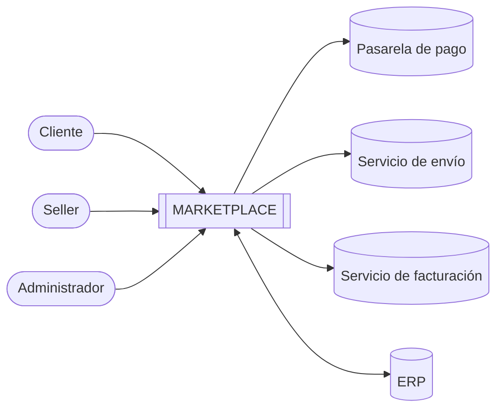

# 01 — Actores del sistema

Los actores son personas, organizaciones o sistemas externos que están **fuera del sistema** e interactúan con él para realizar una acción o intercambiar información.

## Actores humanos

| ID | Actor | Descripción | ¿Qué necesita realizar? |
|---|---|---|---|
| A01 | **Cliente** | Persona dueña de una mascota que compra productos en el marketplace. | Registrarse, buscar productos, consultar información, agregar productos al carrito, realizar pedidos, efectuar el pago y consultar sus pedidos. |
| A02 | **Seller** | Tienda o vendedor independiente que ofrece productos para mascotas en la plataforma. | Registrar, actualizar y consultar sus productos, gestionar su stock y la información relacionada con sus ventas. |
| A03 | **Administrador** | Personal de la empresa responsable de operar la plataforma. | Administrar la plataforma: gestionar sellers, categorías, usuarios y supervisar pedidos. |

## Sistemas externos

| ID | Actor | Tipo | ¿Qué necesita realizar? |
|---|---|---|---|
| A04 | **Pasarela de pago** | Sistema externo (ej. Niubiz, Culqi, Mercado Pago) | Procesar los pagos con tarjeta u otros medios y devolver la confirmación. |
| A05 | **Servicio de envío** | Sistema externo (operador logístico) | Gestionar la información de entrega y el seguimiento de los pedidos. |
| A06 | **Servicio de facturación** | Sistema externo (facturación electrónica SUNAT / OSE) | Generar los comprobantes de pago (boleta o factura electrónica). |
| A07 | **ERP** | Sistema externo de la empresa | Proporcionar información de productos y stock. |

## Diagrama de contexto

