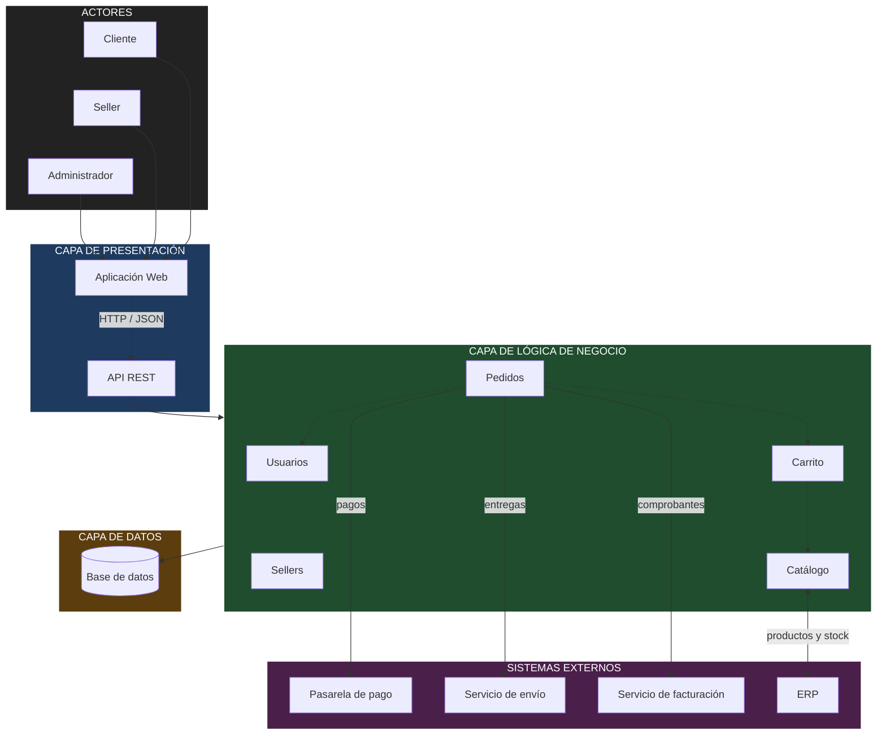

# Arquitectura inicial del sistema

## 1. Estilo arquitectónico

Se adopta una **arquitectura en tres capas**. Cada capa tiene sus propias responsabilidades y se comunica con la capa inmediata inferior. Esta decisión responde principalmente a **DA06 (mantenibilidad)** y **DA05 (API REST)**.

| Capa | Pregunta que responde | Responsabilidad |
|---|---|---|
| **Presentación** | ¿Cómo interactúa el usuario? | Aplicación web (catálogo, carrito, login, panel del seller y del administrador) y API REST que expone las operaciones. |
| **Lógica de negocio** | ¿Qué hace el sistema? | Reglas y procesos: validar compras, gestionar pedidos, controlar stock, procesar pagos. |
| **Datos** | ¿Dónde se almacena la información? | Persistencia de usuarios, sellers, productos, carritos, pedidos y pagos. |

## 2. Módulos de la lógica de negocio

| Módulo | Responsabilidad | Requisitos que atiende |
|---|---|---|
| **Usuarios** | Registro, inicio de sesión, roles y direcciones de entrega. | RF09, RF10, RF12 |
| **Sellers** | Alta, actualización y desactivación de sellers; consulta de sus ventas. | RF07, RF15 |
| **Catálogo** | Productos, categorías, búsqueda, filtros y stock. | RF01, RF02, RF03, RF16, RF17, RF18 |
| **Carrito** | Agregar, modificar y eliminar productos del carrito. | RF04 |
| **Pedidos** | Generar pedidos, pago, envío, comprobante y seguimiento. | RF05, RF06, RF08, RF11, RF13, RF14 |

## 3. Dependencias entre módulos

- **Carrito** depende de **Catálogo** (precio y stock del producto).
- **Pedidos** depende de **Carrito**, **Catálogo** (descontar stock) y **Usuarios** (cliente y dirección).
- **Sellers** depende de **Usuarios** (cuenta del seller) y **Catálogo** (sus productos).

## 4. Integraciones con sistemas externos

| Sistema externo | Módulo que lo usa | Propósito | Driver |
|---|---|---|---|
| Pasarela de pago | Pedidos | Procesar el pago del pedido | DA04 |
| Servicio de envío | Pedidos | Registrar la entrega y obtener el seguimiento | DA07 |
| Servicio de facturación | Pedidos | Emitir boleta o factura electrónica | DA07 |
| ERP | Catálogo | Sincronizar productos y stock | DA07 |

> **Decisión de diseño:** las integraciones se realizan desde la **capa de lógica de negocio** (módulos Pedidos y Catálogo), no desde la capa de datos. La base de datos solo almacena información; la decisión de cuándo cobrar, despachar o facturar es una regla de negocio.

## 5. Diagrama de arquitectura

## 6. Descripción

La arquitectura inicial se organiza en tres capas principales:

- **Presentación:** permite la interacción de los usuarios con el sistema mediante la aplicación web, que consume la API REST.
- **Lógica de negocio:** contiene los principales módulos responsables de las funcionalidades del sistema: usuarios, sellers, catálogo, carrito y pedidos.
- **Datos:** permite almacenar y consultar la información mediante una base de datos.

Además, el módulo de **Pedidos** se integra con la **pasarela de pago**, el **servicio de envío** y el **servicio de facturación**, mientras que el módulo de **Catálogo** se sincroniza con el **ERP** para mantener actualizados los productos y el stock.

## 7. Cómo responde la arquitectura a los drivers

| Driver | Respuesta en la arquitectura |
|---|---|
| DA01 Escalabilidad | La API REST es sin estado, por lo que puede replicarse detrás de un balanceador durante las campañas. |
| DA02 Rendimiento | El módulo Catálogo concentra las consultas más frecuentes y puede optimizarse (índices, caché) sin tocar otros módulos. |
| DA03 Seguridad | La autenticación y los roles se centralizan en el módulo Usuarios; los datos de tarjeta nunca pasan por la base de datos propia. |
| DA04 Pasarela de pago | La integración está aislada dentro de Pedidos. |
| DA05 API REST | Toda comunicación entre la aplicación web y el backend pasa por la API REST. |
| DA06 Mantenibilidad | Las capas y módulos separan responsabilidades; un cambio en un módulo no obliga a modificar los demás. |
| DA07 Servicios externos | Cada integración se asigna a un único módulo, lo que facilita cambiar de proveedor. |