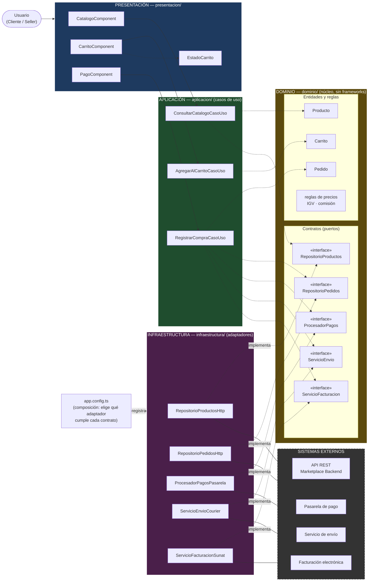

# Enfoque arquitectónico: Clean Architecture

## 1. Ficha del enfoque

| Elemento | Descripción aplicada al Marketplace |
|---|---|
| Patrón / enfoque arquitectónico | Clean Architecture (Arquitectura Limpia). |
| Objetivo | Separar responsabilidades y controlar las dependencias hacia el dominio. |
| ¿Qué problema resuelve? | Evita el acoplamiento entre la interfaz Angular, las reglas del negocio y las tecnologías externas, como bases de datos, API y servicios de pago. |
| Capas definidas | Presentación, Aplicación, Dominio e Infraestructura. |
| Driver que responde | DA06 – Mantenibilidad (ADR-002); también apoya DA04 y DA07 mediante contratos y adaptadores. |
| Beneficios | Facilita el mantenimiento y las pruebas unitarias. Permite cambiar implementaciones técnicas sin modificar innecesariamente las reglas del negocio. Mejora la organización y separación de responsabilidades del código. |

## 2. Regla de dependencia

Las dependencias del código **siempre apuntan hacia el centro**:

```
Presentación  ─┐
               ├──►  Aplicación  ──►  Dominio
Infraestructura┘                       ▲
       └──── implementa los contratos ─┘
```

1. El **dominio** no importa nada de las capas externas (ni Angular, ni HttpClient, ni librerías de pago).
2. Los **casos de uso** solo conocen entidades y contratos del dominio.
3. Los **adaptadores** de infraestructura implementan los contratos del dominio; son intercambiables.
4. Cambiar de tecnología o proveedor significa cambiar el adaptador registrado, no el dominio.

## 3. Organización de responsabilidades por capa

| Carpeta | Capa | ¿Qué contiene? | Ejemplos en el Marketplace |
|---|---|---|---|
| `dominio/` | Domain | Entidades, objetos de valor, reglas de negocio y contratos (puertos). | Entidades: `Producto`, `Carrito`, `Pedido`, `Seller`. Reglas: cálculo de subtotal, IGV y comisión. Contratos: `RepositorioProductos`, `RepositorioPedidos`, `ProcesadorPagos`, `ServicioEnvio`, `ServicioFacturacion`, `SincronizadorERP`. |
| `aplicacion/` | Application | Casos de uso que coordinan el dominio y DTO cuando sean necesarios. | `ConsultarCatalogoCasoUso`, `AgregarAlCarritoCasoUso`, `RegistrarCompraCasoUso`, `RegistrarProductoSellerCasoUso`. |
| `presentacion/` | Presentación / adaptadores de interfaz | Pantallas, componentes visuales y estado de la vista. | `CatalogoComponent`, `CarritoComponent`, `PagoComponent`, `PanelSellerComponent`, `EstadoCarrito`. |
| `infraestructura/` | Infraestructura / frameworks y drivers | Implementaciones concretas de los contratos para APIs, base de datos y servicios externos. | `RepositorioProductosHttp`, `RepositorioPedidosHttp`, `ProcesadorPagosPasarela`, `ServicioEnvioCourier`, `ServicioFacturacionSunat`, `SincronizadorERPHttp`. |
| `app.config.ts` | Composición | Único lugar que decide qué adaptador cumple cada contrato y lo inyecta. | Registrar `ProcesadorPagosPasarela` para `ProcesadorPagos` (o uno simulado para pruebas). |

## 4. Ejemplo de flujo: registrar una compra

1. `PagoComponent` (presentación) invoca a `RegistrarCompraCasoUso` (aplicación).
2. El caso de uso usa las entidades `Carrito` y `Pedido` (dominio) para validar stock y calcular el total.
3. Pide cobrar mediante el contrato `ProcesadorPagos` y guardar mediante `RepositorioPedidos`, sin saber qué tecnología hay detrás.
4. `ProcesadorPagosPasarela` y `RepositorioPedidosHttp` (infraestructura) hacen la comunicación real con la pasarela y la API REST.

Si mañana se cambia de pasarela de pago, solo se crea un nuevo adaptador y se registra en `app.config.ts`; el caso de uso y el dominio no cambian.

## 5. Diagrama del enfoque



**Leyenda:** flecha continua = llamada en tiempo de ejecución; flecha punteada = dependencia de código (siempre apunta hacia el dominio); "implementa" = el adaptador cumple el contrato definido en el dominio (inversión de dependencias).