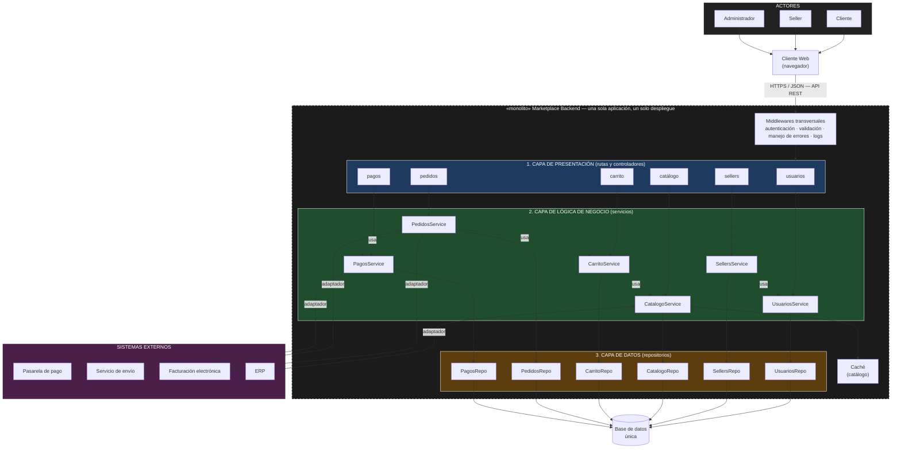

# Estilo arquitectónico (estructura global del sistema)

## 1. Estilo seleccionado

Se adopta un **monolito modular organizado en capas**.

- **Monolito:** el backend es una sola aplicación que se despliega como una única unidad (un solo proceso y una sola base de datos).
- **Modular:** dentro del monolito, las funcionalidades se agrupan en módulos de negocio independientes: Usuarios, Sellers, Catálogo, Carrito, Pedidos y Pagos.
- **En capas:** cada módulo se divide internamente en presentación, lógica de negocio y datos.

> Capas = organización lógica del código. Monolito = unidad de despliegue. Ambos conceptos pueden coexistir.

## 2. Alternativas evaluadas

| Estilo | Ventajas | Desventajas | ¿Se elige? |
|---|---|---|---|
| Monolito tradicional | Simple de construir y desplegar. | Los módulos terminan acoplados; difícil de mantener al crecer. | No |
| **Monolito modular en capas** | Despliegue simple y módulos bien separados; permite extraer servicios más adelante. | Requiere disciplina para respetar los límites entre módulos. | **Sí** |
| Microservicios | Escalado y despliegue independiente por servicio. | Alta complejidad operativa (red, despliegues, datos distribuidos) para un proyecto que recién inicia. | No |
| Event-driven / Serverless | Desacoplamiento y escalado automático. | Mayor complejidad de diseño y depuración; no lo exigen los drivers actuales. | No |

## 3. Justificación según los drivers

| Driver | Cómo lo atiende el estilo elegido |
|---|---|
| DA01 – Escalabilidad | El backend es sin estado, por lo que el monolito puede replicarse detrás de un balanceador durante las campañas. |
| DA02 – Rendimiento | La comunicación entre módulos es en memoria (sin llamadas de red) y el catálogo puede usar caché. |
| DA03 – Seguridad | La autenticación y autorización se aplican de forma transversal a todos los módulos mediante middlewares. |
| DA04 – Pago externo | La pasarela se integra solo desde el módulo Pagos mediante un adaptador. |
| DA05 – API REST | El frontend se comunica con el backend únicamente a través de la API REST. |
| DA06 – Mantenibilidad | Cada módulo tiene límites claros; un cambio en un módulo no obliga a modificar los demás. |
| DA07 – Integraciones externas | Envío, facturación y ERP se conectan mediante adaptadores aislados dentro de su módulo. |

## 4. Diagrama del estilo arquitectónico

**Leyenda:** las flechas continuas son llamadas entre capas (de arriba hacia abajo); las flechas punteadas son uso entre módulos, que siempre se hace a través del servicio del otro módulo.

## 5. Reglas del estilo

1. Cada capa solo invoca a la capa inmediatamente inferior.
2. Un módulo no accede al repositorio ni a las tablas de otro módulo; se comunica llamando a su servicio.
3. Las integraciones externas se hacen solo mediante adaptadores dentro del módulo responsable.
4. Todo se ejecuta en un único proceso con una única base de datos.